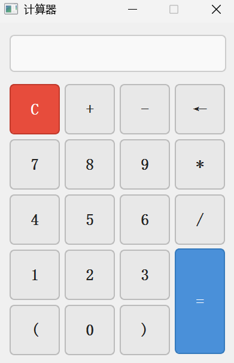

# Qt Simple Calculator

> 一个基于 **C++11** 与 **Qt5 Widgets** 构建的简易图形界面计算器，适合作为 Qt 入门学习项目或 GUI 编程教学案例。

---

## 目录

- [核心功能](#核心功能)
- [截图预览](#截图预览)
- [技术栈](#技术栈)
- [项目结构](#项目结构)
- [环境依赖与编译指南](#环境依赖与编译指南)
- [使用说明](#使用说明)
- [设计亮点](#设计亮点)
- [许可证](#许可证)


---

## 核心功能

- **整数四则运算**：支持 `+`、`-`、`*`、`/` 及括号 `()` 的混合表达式计算
- **一元负号**：支持负数输入，如 `-5 + 3` 或 `(-3) * 4`
- **键盘交互**：支持实体键盘输入（数字键、运算符、回车计算、Backspace 删除、Esc 清空）
- **防崩溃设计**：空栈、除零、括号不匹配、非法字符等异常均有安全处理与友好提示
- **MVC 架构**：计算逻辑与 UI 界面解耦，便于扩展与维护
- **QSS 样式美化**：使用 Qt Style Sheets 实现现代化按钮与输入框视觉效果

---

## 截图预览

<div align="center">
  
</div>

-----

## 技术栈

| 技术     | 版本要求              |
| -------- | --------------------- |
| C++      | C++11 及以上          |
| Qt       | Qt 5.x (Widgets 模块) |
| 构建工具 | qmake                 |

---

## 项目结构

```
qt-calculator/
|
├── main.cpp              # 程序入口
├── widget.h / widget.cpp # 主窗口 UI 与交互逻辑
├── calculatorlogic.h /   # 计算引擎（表达式解析与求值）
│   calculatorlogic.cpp
├── widget.ui             # Qt Designer UI 布局文件
└── calculator.pro        # qmake 项目文件
```

### 架构说明

- **`Widget`**：负责 UI 渲染、按钮信号槽绑定、键盘事件捕获与结果显示
- **`CalculatorLogic`**：独立的计算引擎，基于双栈（操作数栈 + 运算符栈）实现中缀表达式求值（类 Shunting-yard 算法）
- 两者通过 **`CalculatorLogic::Result`** 结构体通信，UI 层不直接参与任何数值计算

---

## 环境依赖与编译指南

### 前置条件

- 安装 [Qt5](https://www.qt.io/download)（确保包含 Qt Widgets 模块）
- 安装支持 C++11 的编译器（MSVC、MinGW、GCC 或 Clang）
- 配置好 `qmake` 环境变量

### 构建步骤

```bash
# 1. 进入项目目录
cd calculator

# 2. 生成 Makefile
qmake calculator.pro

# 3. 编译
make                # Linux / macOS
mingw32-make        # Windows (MinGW)
nmake               # Windows (MSVC)

# 4. 运行
./calculator        # Linux / macOS
release/calculator.exe  # Windows
```

---

## 使用说明

### 鼠标操作

- 点击数字与运算符按钮输入表达式
- 点击 `=` 或 `Enter` 计算结果
- 点击 `C` 清空当前表达式
- 点击 `←` 或 `Backspace` 删除最后一个字符

### 键盘快捷键

| 按键                    | 功能         |
| ----------------------- | ------------ |
| `0` ~ `9`           | 输入数字     |
| `+` `-` `*` `/` | 输入运算符   |
| `(` `)`             | 输入括号     |
| `Enter` / `=`       | 计算结果     |
| `Backspace`           | 删除末尾字符 |
| `Delete` / `Esc`    | 清空表达式   |

---

## 设计亮点

1. **异常安全**：计算引擎对栈操作、字符串解析、除零等边界情况做了完整保护，程序不会因错误输入而崩溃
2. **解耦设计**：计算逻辑完全独立于 UI，方便后续替换为更复杂的解析器（如支持科学计算、变量等）
3. **Qt 信号槽机制**：展示了 `connect()` 手动绑定与 `keyPressEvent` 事件处理的典型用法
4. **QSS 样式应用**：通过 `setStyleSheet()` 实现轻量级 UI 美化，无需额外图片资源

----

## 许可证

本项目基于 [MIT License](LICENSE) 开源，你可以自由学习、修改和分发。

```
MIT License

Copyright (c) 2026 Tianxiang Li

Permission is hereby granted, free of charge, to any person obtaining a copy
of this software and associated documentation files (the "Software"), to deal
in the Software without restriction, including without limitation the rights
to use, copy, modify, merge, publish, distribute, sublicense, and/or sell
copies of the Software, and to permit persons to whom the Software is
furnished to do so, subject to the following conditions:

The above copyright notice and this permission notice shall be included in all
copies or substantial portions of the Software.
```

---

> 如果你在学习过程中有任何问题，欢迎提交 [Issue](https://github.com/[YourUsername]/MusicPlayer4/issues) 或 [Pull Request](https://github.com/[YourUsername]/MusicPlayer4/pulls)。祝你学习愉快！
>
> ⭐ 如果这个项目对你有帮助，欢迎 Star 支持！
